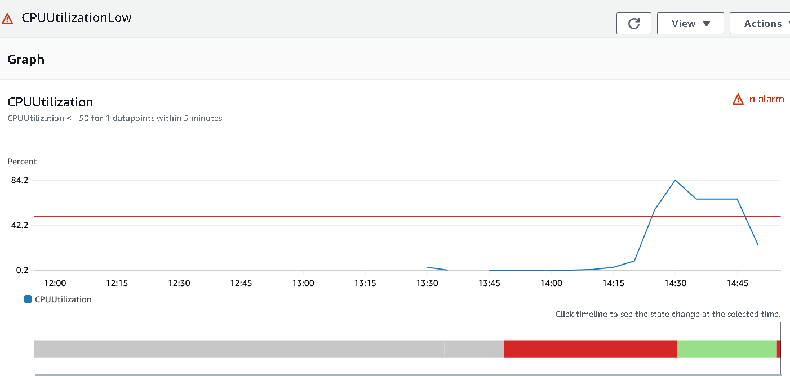
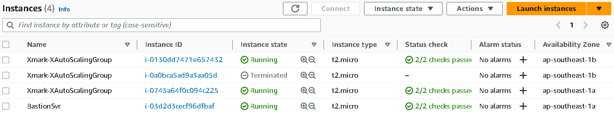
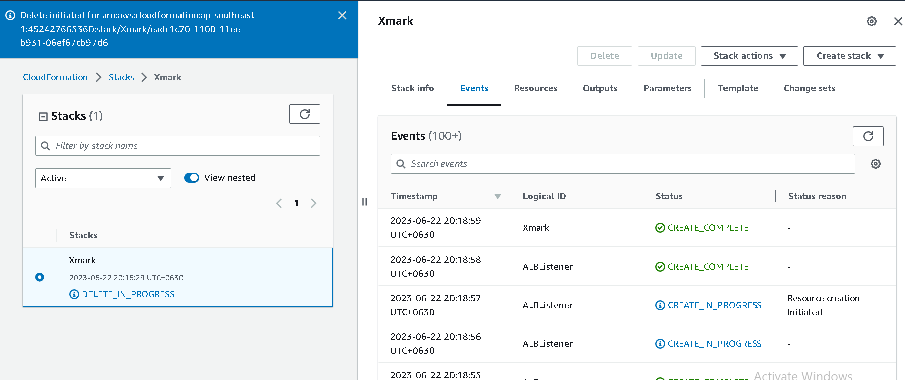

## Project Explained:
---
 Resources in my project include: 
1. Network Resources
2. LoadBalancer Resources
3. Autoscaling Resources
4. Autoscaling Policy

### 1. Network Resources
> **Two public subnets** and **two private subnets** are created (for LoadBalancer and EC2 instances that will be deployed by AutoScaling Group).
>
> **IGW** and **NAT Gateway** are created. IGW is for **PublicSubnets** and is attached to the **PublicRouteTables** via **PublicRoutes**. NATGateway is for **PrivateSubnets** and is attached to the **PrivateRouteTables** via **PrivateRoutes**.
>
> Then, Subnets and RouteTables are associated.

### 2. LoadBalancer Resources
> **ALBSecurityGroup** allows HTTP(80) and HTTPS(443) from the Internet. Two PublicSubnets (with IGW) are added to ALB. **ALB Scheme** is set to internet-facing. If my ALB only needs to receive incoming traffic from the internet, I will use IGW. If my ALB needs to initiate outbound connections, I will use both IGW and NAT Gateway.
As I set my ALB to internet-facing, it will have a public IP address or public DNS name that will allow clients to connect directly to it.
> 
> **In TargetGroup**, HealthCheck is enabled for EC2 instances in AutoScalingGroup. Every 60 seconds, ALB will send HTTP requests to each target's root path (e.g., http://<target-ip>/) to check their health. If the target responds with a successful HTTP status code (e.g., 200 OK), the ALB considers the target healthy. It is unhealthy if the target responds with an error code (e.g., 4xx or 5xx status codes). ALB will wait 10 seconds to get a response from targets. If the target successfully responds 3 times (60 x 3 = 180s), ALB will mark the target as healthy. If the response is unsuccessful 5 times (60 x 5 = 300s), the target is marked as unhealthy. "deregistration_delay.timeout_seconds" attribute is set to 0, that is targets are deregistered immediately upon detection of unhealthy status.
>
> **ALBListener** will "listen" incoming HTTP requests on port 80 and "forward" them to the TargetGroup. The TargetGroup is responsible for distributing the requests to the appropriate targets (EC2 instances) based on the configured load balancing algorithm and health checks.

### 3.Autoscaling Resources
>**MyAutoScalingGroup** is associated with ALBTargetGroup. Two PrivateSubnets are added to MyAutoScalingGroup. Therefore, EC2 instances will be in PrivateSubnet and they will get Load Balancing, Health Checks, and Autoscaling effects. In MyAutoScalingGroup, the minimum number of EC2 instances that will be running is 2 and the maximum number is 4. When the group is launched, it will start with 2 instances as I set the DesiredCapacity to 2. Emails from SNSTopic will be received when EC2 instances are started, stopped, or facing errors when starting and stopping.
>
>**In EC2InstanceSecurityGroup**, required protocols are allowed. SSH is also allowed for Testing. As my instances are in PrivateSubnet, public IP will not be available. Then, I will create Bastion Host, first SSH to the host, and remotely manage the EC2s for Stress testing.
>
>**In LaunchConfiguration**, I use Instance type (t2.micro) and the latest AmiId. Key pair is also created. UserData is the script I downloaded for custom memory metrics. It will be sent to CloudWatch Alarm.

### 4.AutoScaling Policy 
> **Simple Scaling Policy** is used to Scale down and Scale-up EC2 instances based on CPU utilization and Memory utilization. Adding or removing instances are in a fixed amount. **Scaling Adjustment** is set to 1 and -1 which means that only one instance is added or removed during autoscaling. **Cooldown** is 300s that is scaling action is disabled for 300 seconds once an autoscaling is triggered.  
>
> One instance will be added when the memory utilization threshold is over 80 percent for 300 seconds and removed when the utilization drops below 40 percent for 300 seconds. And, also one instance will be added when the CPU utilization is greater than 90 percent for 300 seconds and removed when the threshold drops below 50 percent for 300 seconds.
>
> In my lab, I only use CPU Utilization Scale Out and Scale In scenarios as my memory stress script is not working although custom memory metrics can be imported to CloudWatch.
---
# Step Details:

## I. Installation Stage:

1. It is the Design of my Lab shown by Designer.

---
2. I will use CloudFormation to upload the configuration file and create a stack.

---
3. SNS email is sent when AutoscalingGroup launches Instances.

---
4. Stack Creation is completed.

---
5. Bastion Host is manually created and it is used to ssh into EC2 instances and test load.

---
6. SSH into the Host with public IP address and key pair.

---
7. CloudWatch Alarm section has 4 alarms. As there is no load on EC2, CPUUtilizationLow is in alarm. But the instances are at minimum capacity and there will be no changes occurring.

---

## II. Scale-Out Testing Stage:

1. There is Low CPU utilization shown in CloudWatch.

---
2. Then, in the EC2 console, 'htop' command is used to monitor the CPU and memory utilization.

---
3. After installing the stress script, the CPU utilization is 'High' as shown below.

---
4. Let's go back to CloudWatch and check the alarm. After a few minutes, the 'in alarm' stage is triggered.

---
5. And then, an SNS email is received that the EC2 Instance is Launched.

---
6. Check the EC2 instances to verify that the EC2 instance is added.

---

## III. Scale In Testing Stage

1. The stress task is killed with the process id in the ssh console.

---
2. Check the CloudWatch alarm and wait for the 'in alarm' stage.

---
3. And then, an SNS email is received that the EC2 instance is 'Terminated'.

---
4. Go to the EC2 instances and make sure that the EC2 instance is terminated.

---
## IV. Deleting Resources

Finally, CloudFormation Template is Deleted. 

